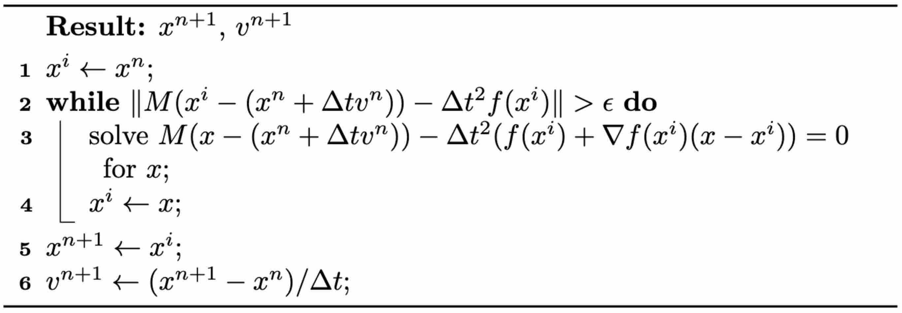

## Implicit Time Integration

In contrast to explicit time integration, implicit time integration requires solving a system of equations to determine the values of \\(x^{n+1}\\) and \\(v^{n+1}\\). A notable benefit of this approach is its potential for greatly improved stability. The simplest form of implicit integration, the backward Euler method, is introduced as follows.

> **{{met}}{met:lec1:backward_euler}[Backward Euler Time Integration Application to Newton's Second Law]**
Given the current state variables, the mass matrix, and the time interval from \\(t^n\\) to \\(t^{n+1}\\), the update rules are as follows:
$$
\begin{aligned}
x^{n+1} & = x^n + \Delta t v^{n+1}, \\
v^{n+1} & = v^n + \Delta t M^{-1}f^{n+1},
\end{aligned}
{{numeq}}{eq:lec1:updateRule_implicit}
$$
where \\(n\\) ranges from \\(0,1,2,\dots\\).

In many scenarios discussed in this book, the forces are derived from position vectors \\(x\\). Thus, we can represent \\(f^{n+1} = f(x^{n+1})\\). It's crucial to recognize that the update for \\(x^{n+1}\\) depends on knowing \\(v^{n+1}\\), yet the calculation of \\(v^{n+1}\\) is contingent on \\(x^{n+1}\\). This interdependence creates a cyclical dependency, necessitating the resolution of a system of equations to accurately find \\(x^{n+1}\\) and \\(v^{n+1}\\). By formulating \\(v^{n+1} = (x^{n+1} - x^n) / \Delta t\\), Equation {{eqref:eq:lec1:updateRule_implicit}} can be rephrased as:
$$
M (x^{n+1} - (x^n + \Delta t v^n)) - \Delta t^2 f(x^{n+1}) = 0. {{numeq}}{eq:lec1:system_IE}
$$
Given that forces \\(f\\) often exhibit nonlinearity with respect to positions \\(x\\), Equation {{eqref:eq:lec1:system_IE}} generally becomes nonlinear, requiring the use of nonlinear root finding techniques like **Newton's method** for solution.

> **{{met}}{met:lec1:newton_backward_euler}[Newton's Method Applied to Backward Euler Time Integration]**
As described in the algorithm below, Newton's method is an iterative technique starting from an initial estimate \\(x^i\\) of the solution. At the current iteration \\(x^i\\), it linearly approximates \\(f(x^{n+1}) \approx f(x^i) + (x^{n+1}-x^i) \nabla f(x^i)\\), then resolves a linear system and updates the iteration. This process is repeated until a satisfactory degree of convergence is reached. <figure>
<b><figcaption>{{alg}}{alg:lec1:newton_method_IE}[Newton's Method for Backward Euler Time Integration]</figcaption></b>
</figure>

While the backward Euler method ensures **unconditional stability** even for large values of \\(\Delta t\\), it's crucial to recognize that increasing \\(\Delta t\\) may lead to poorer system conditioning. This complication can make solving the linear system more challenging. Additionally, it's important to remember that force linearization is an approximation. If the initial estimate for the solution is far from the actual solution, the standard iteration of Newton's method might not converge, and it could even diverge.

In later discussions, we will introduce a modified version of Newton's method. This adaptation is designed to guarantee convergence for specific types of problems, regardless of the initial estimate or the size of \\(\Delta t\\).

