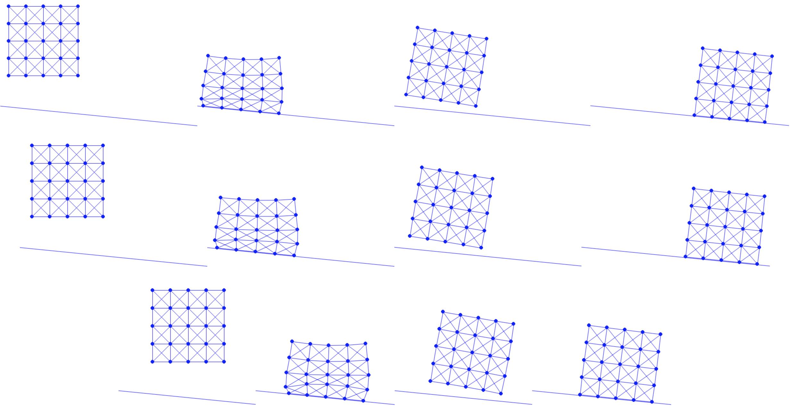

## Slope Friction

Now to implement friction for the slope, we start by implementing the functions that calculate $f_0(\| \bar{v}_k \| \hat{h})$, $f_1(\| \bar{v}_k \|)/\| \bar{v}_k \|$, and $(f'_1(\|\bar{\mathbf{v}}_k\|)\|\bar{\mathbf{v}}_k\| - f_1(\|\bar{\mathbf{v}}_k\|))/\|\bar{\mathbf{v}}_k\|^2$ according to Equation {{eqref: eq:lec9:f0}}, Equation {{eqref: eq:lec9:f1_term}}, and Equation {{eqref: eq:lec9:hess_term}} respectively.

{{imp}}{imp:lec10:f_terms}[Friction helper functions, FrictionEnergy.py]
```python
{{#include solid-sim-tutorial/4_friction/FrictionEnergy.py:f_terms}}
```

With these terms available, we can then implement the semi-implicit friction energy value, gradient, and Hessian computations according to Equation {{eqref: eq:lec9:fric_potential}}, Equation {{eqref: eq:lec9:fric_grad}}, and Equation {{eqref: eq:lec9:fric_hess}} respectively.

{{imp}}{imp:lec10:friction_val_grad_hess}[Friction value, gradient, and Hessian, FrictionEnergy.py]
```python
{{#include solid-sim-tutorial/4_friction/FrictionEnergy.py:val_grad_hess}}
```

Note that in Numpy, matrix-matrix and matrix-vector products are realized by the `dot()` function.
For implicit Euler, $v = (x - x^n) / h$ and so $\hat{h}= h$.
Here `mu_lambda` stores $\mu \lambda_k^n$ for each node, where the normal force magnitude $\lambda_k^n$ is calculated using $x^n$ at the beginning of each time step.

{{imp}}{imp:lec10:use_mu_lambda}[Use mu and lambda, time_integrator.py]
```python
{{#include solid-sim-tutorial/4_friction/time_integrator.py:mu_lambda}}
```

{{imp}}{imp:lec10:compute_mu_lambda}[Compute mu and lambda, BarrierEnergy.py]
```python
{{#include solid-sim-tutorial/4_friction/BarrierEnergy.py:compute_mu_lambda}}
```

Since the slope is static, and the normal direction is the same everywhere, $T$ is constant and so can be discretized accurately.

Finally, we set friction coefficient $\mu$ and pass it to the time integrator where we add friction energy to model semi-implicit friction on the slope.

```python
{{#include solid-sim-tutorial/4_friction/simulator.py:set_mu}}
```

Now we are ready to test the simulation with different friction coefficients. Since our slope has an inclined angle $\theta$ with $\tan(\theta) = 0.1$, we test $\mu=0.1$, $0.11$, and $0.2$ ({{ref: fig:lec10:diff_mu_exp}}). Here we see that when $\mu=0.1$, the critical value that provides dynamic friction forces in the same magnitude with that of the gravity component on the slope, the square keeps sliding after gaining the initial momentum ({{ref: fig:lec10:diff_mu_exp}} top). When we set $\mu=0.11$, right above the critical value, the square slides a while and then stopped, showing that static friction is properly resolved ({{ref: fig:lec10:diff_mu_exp}} middle). With $\mu=0.2$, the square stops even earlier ({{ref: fig:lec10:diff_mu_exp}} bottom).

<figure>
    <center>
    
    </center>
    <figcaption><b>{{fig}}{fig:lec10:diff_mu_exp}</b> With friction coefficient $\mu = 0.1$ (top), $0.11$ (middle), and $0.2$ (bottom), we simulate an elastic square dropped onto a slope. Except the top one that the square keeps sliding, the lower two with larger $\mu$ both end up with a static equilibrium. </figcaption>
</figure>