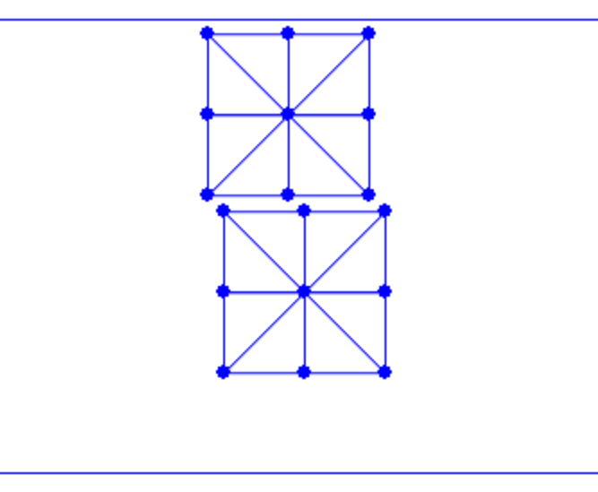

## Scene Setup and Boundary Element Collection

To begin with, we set up a new scene with two squares falling onto the ground, compressed by the ceiling so that self-contact will occur between these squares.

{{imp}}{imp:lec21:sim_setup}[Simulation setup, simulator.py]
```python
{{#include solid-sim-tutorial/7_self_contact/simulator.py:sim_setup}}
```
In line 17, we adapt the DOF index of the ceiling from $(n\_seg + 1) * (n\_seg + 1)$ to $(n\_seg + 1) * (n\_seg + 1) * 2$, as we now have two squares. Line 26 generates the first square on the top, while lines 27 and 28 generate the second square on the bottom by creating copies and offsets.

The initial frame, as shown in {{ref: fig:lec21:initial_frame}}, is now established. However, without handling self-contact, these two squares cannot interact with each other yet.

<figure>
    <center>
    
    <figcaption><b>{{fig}}{fig:lec21:initial_frame}</b> The new scene setup with 2 squares to fall. </figcaption>
    </center>
</figure>

To handle contact, we first need to collect all boundary elements. In 2D, this involves identifying the nodes and edges on the boundary where contact forces will be applied to all close but non-incident point-edge pairs. The following function finds all boundary nodes and edges given a triangle mesh:

{{imp}}{imp:lec21:find_boundary}[Collect boundary elements, square_mesh.py]
```python
{{#include solid-sim-tutorial/7_self_contact/square_mesh.py:find_boundary}}
```

This function is called in `simulator.py`, and the boundary elements are then passed to the time integrator for energy, gradient, and Hessian evaluations, as well as line search filtering.
