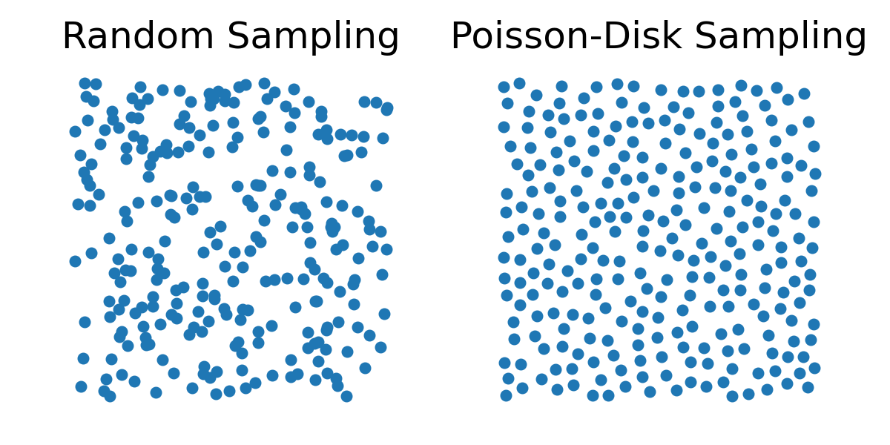

## Material Particles

In the Material Point Method (MPM), we discretize a deformable solid into a finite set of material points (also referred to as particles), which carry the complete state of the material throughout the simulation. These material points serve as Lagrangian carriers of physical quantities, including:

- $\mathbf{x}_p^n$: the position of particle $p$ at time $t^n$

- $\mathbf{v}_p^n$: the velocity of particle $p$

- $V_p^n$: the volume of particle $p$

- $m_p$: the mass of particle $p$ (constant over time)

- $\mathbf{F}_p^n$: the deformation gradient at particle $p$

We adopt the convention that all particle-related quantities are subscripted by $p$.

**Comparison to Finite Element Methods**: In traditional FEM, the deformable body is represented through piecewise linear displacement fields defined over a fixed mesh. Physical quantities such as strain and stress are derived from gradients of these displacement fields, which depend on the connectivity of mesh elements (see [Piecewise Linear Displacement Field](./lec19.1-linear_disp_field.md)).

In contrast, MPM does not rely on a mesh to store state or define deformation. Instead, each particle tracks its own deformation gradient $\mathbf{F}_p^n$ independently.

**Sampling Material Particles**: To initialize an MPM simulation, the continuous solid domain is sampled into a finite number of particles. The quality of this sampling has a significant impact on numerical stability and accuracy.

- **Random Sampling**. Naively placing particles at random positions can lead to clustering and large local variations in density, which degrade both simulation accuracy and numerical stability.

- **Poisson-Disk Sampling**. Instead, Poisson-disk Sampling is commonly used because it guarantees a minimum separation between particles, producing a more uniform distribution. This improves interpolation accuracy, minimizes numerical artifacts, and yields more stable contact behavior.

<figure>
    

    
    

    <figcaption><b>{{fig}}{fig:lec25:random_vs_poisson_disk}</b> Comparison of random sampling and Poisson-disk sampling in a unit square with the same number of samples: Poisson-disk sampling produces more uniform spacing between points. </figcaption>
</figure>

**Estimating Particle Volume**:

Since we track the deformation gradient $\mathbf{F}_p^n$ at each particle, we can compute volume change from the determinant:

$$
V_p^n \approx J_p^n \cdot V_p^0 = \det(\mathbf{F}_p^n) \cdot V_p^0
$$

Here, $V_p^0$ is the rest volume of particle $p$, typically computed as:

$$
V_p^0 = \frac{V_{\text{rest}}}{N_{\text{particles}}}
$$

And we compute $m_p$ as:

$$
m_p = \rho_0 \cdot V_p^0
$$