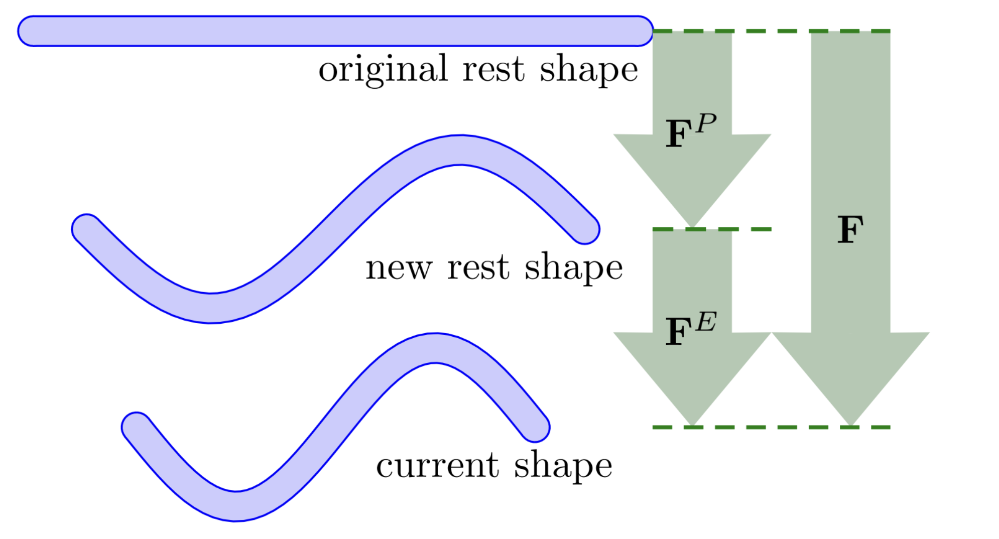

# Discretization of Plastic Flow

Plasticity is introduced into MPM by **multiplicatively decomposing** the deformation gradient $\mathbf{F}$ into elastic and plastic parts:

$$
\mathbf{F} = \mathbf{F}_\mathrm{E} \, \mathbf{F}_\mathrm{P}
$$

Here, $\mathbf{F}_\mathrm{P}$ represents the accumulated irreversible deformation, while $\mathbf{F}_\mathrm{E}$ captures the recoverable elastic deviation from the plastically deformed configuration.

This decomposition separates material behavior into two parts:  
- The **plastic part** $\mathbf{F}_\mathrm{P}$ stores permanent changes (e.g., bending a metal rod into a spring),  
- The **elastic part** $\mathbf{F}_\mathrm{E}$ responds to current deformation relative to that shape (e.g., compressing the spring slightly). 

<figure>
    

    
    

    <figcaption><b>{{fig}}{fig:lec26:decomposition_of_deformation_gradient}</b> Multiplicative decomposition of the deformation gradient. </figcaption>
</figure>

Stress is computed solely from $\mathbf{F}_\mathrm{E}$ using the hyperelastic constitutive model. Plastic flow is triggered when stress exceeds a material-specific limit and updates $\mathbf{F}_\mathrm{P}$ to ensure the stress stays within the yield surface.

> **{{def}}{def:lec17:yield_surface}[Yield Surface]**
> We define a **Yield Condition** $y(\boldsymbol{\tau}) \leq 0$ on the **Kirchhoff stress** $\boldsymbol{\tau}$ derived from $\mathbf{F}_\mathrm{E}$. The boundary $y(\boldsymbol{\tau}) = 0$ is known as the **Yield Surface**. When elastic stress exceeds this surface, plastic flow is triggered to restore admissibility.

This framework cleanly separates recoverable and permanent deformation by computing stress from $\mathbf{F}_\mathrm{E}$ and evolving $\mathbf{F}_\mathrm{P}$ under plastic flow.