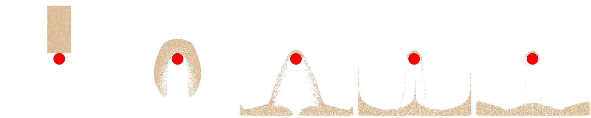

## Putting It All Together

In an MPM simulation, simulation data include material point data and grid data, we defined material point data following [Section 25.1](./lec25.1-material_particles.md), with one additional $\mathbf{C}_p$ used for APIC transfer scheme and `log_J_diff` as the volume correction term used in [Section 28.1](./lec28.1-drucker_prager.md). The sample points are sampled using the Poisson-disk sampling. We define the 2D background as a dense grid, which can be further optimized as a sparse grid, we leave this as the  future work for readers:

{{imp}}{imp:lec28:mpm_data}[Simulation Data]
``` Python
# simulation setup
grid_size = 128 # background Eulerian grid's resolution, in 2D is [128, 128]
dx = 1.0 / grid_size # the domain size is [1m, 1m] in 2D, so dx for each cell is (1/128)m
dt = 2e-4 # time step size in second
ppc = 8 # average particle-per-cell

density = 400 # kg / m^3
E, nu = 3.537e5, 0.3 # sand's Young's modulus and Poisson's ratio
mu, lam = E / (2 * (1 + nu)), E * nu / ((1 + nu) * (1 - 2 * nu)) # sand's Lame parameters
sdf_friction = 0.5 # frictional coefficient of SDF boundary condition
friction_angle_in_degrees = 25.0 # Drucker Prager friction angle
D = (1./4.) * dx * dx # constant D for Quadratic B-spline used for APIC

# sampling material particles with poisson-disk sampling (Section 25.1)
poisson_samples = poisson_disk_sampling(dx / np.sqrt(ppc), [0.2, 0.4]) # simulating a [30cm, 50cm] sand block

# material particles data (Section 25.1)
N_particles = len(poisson_samples)
x = ti.Vector.field(2, float, N_particles) # the position of particles
x.from_numpy(np.array(poisson_samples) + [0.4, 0.55])
v = ti.Vector.field(2, float, N_particles) # the position of particles
vol = ti.field(float, N_particles)         # the volume of particle
vol.fill(0.2 * 0.4 / N_particles) # get the volume of each particle as V_rest / N_particles
m = ti.field(float, N_particles)           # the mass of particle
m.fill(vol[0] * density)
F = ti.Matrix.field(2, 2, float, N_particles)  # the deformation gradient of particles
F.from_numpy(np.tile(np.eye(2), (N_particles, 1, 1)))
C = ti.Matrix.field(2, 2, float, N_particles)  # the affine-matrix of particles

diff_log_J = ti.field(float, N_particles) # tracks changes in the log of the volume gained during extension

# grid data
grid_m = ti.field(float, (grid_size, grid_size))
grid_v = ti.Vector.field(2, float, (grid_size, grid_size))
```

At the beginning of each simulation step, the grid must be cleared before accumulating new particle-to-grid transfers.

{{imp}}{imp:lec28:reset_grid}[Reset Grid Data]
``` Python
def reset_grid():
    # after each transfer, the grid is reset
    grid_m.fill(0)
    grid_v.fill(0)
```

During the particle-to-grid (P2G) transfer, we use quadratic B-spline interpolation to distribute particle mass, momentum, and internal force contributions to neighboring grid nodes.

{{imp}}{imp:lec28:particle_to_grid_transfer}[Particle-to-Grid (P2G) Transfers]
``` Python
@ti.kernel
def particle_to_grid_transfer():
    for p in range(N_particles):
        base = (x[p] / dx - 0.5).cast(int)
        fx = x[p] / dx - base.cast(float)
        # quadratic B-spline interpolating functions (Section 25.2)
        w = [0.5 * (1.5 - fx) ** 2, 0.75 - (fx - 1) ** 2, 0.5 * (fx - 0.5) ** 2]
        # gradient of the interpolating function (Section 25.2)
        dw_dx = [fx - 1.5, 2 * (1.0 - fx), fx - 0.5]

        P = StVK_Hencky_PK1_2D(F[p])
        for i in ti.static(range(3)):
            for j in ti.static(range(3)):
                offset = ti.Vector([i, j])
                dpos = (offset.cast(float) - fx) * dx
                weight = w[i][0] * w[j][1]
                grad_weight = ti.Vector([(1. / dx) * dw_dx[i][0] * w[j][1], 
                                          w[i][0] * (1. / dx) * dw_dx[j][1]])

                grid_m[base + offset] += weight * m[p] # mass transfer
                grid_v[base + offset] += weight * m[p] * (v[p] + C[p] @ dpos) # momentum Transfer, APIC formulation
                # internal force (stress) transfer
                fi = -vol[p] * P @ F[p].transpose() @ grad_weight
                grid_v[base + offset] += dt * fi
```

During the grid-to-particle (G2P) transfer, we gather the updated velocity and affine velocity matrix from the background grid, and compute the trial elastic deformation gradient prior to enforcing plasticity via return mapping.

{{imp}}{imp:lec28:grid_to_particle_transfer}[Grid-to-Particle (G2P) Transfers]
``` Python
@ti.kernel
def grid_to_particle_transfer():
    for p in range(N_particles):
        base = (x[p] / dx - 0.5).cast(int)
        fx = x[p] / dx - base.cast(float)
        # quadratic B-spline interpolating functions (Section 25.2)
        w = [0.5 * (1.5 - fx) ** 2, 0.75 - (fx - 1) ** 2, 0.5 * (fx - 0.5) ** 2]
        # gradient of the interpolating function (Section 25.2)
        dw_dx = [fx - 1.5, 2 * (1.0 - fx), fx - 0.5]

        new_v = ti.Vector.zero(float, 2)
        new_C = ti.Matrix.zero(float, 2, 2)
        v_grad_wT = ti.Matrix.zero(float, 2, 2)
        for i in ti.static(range(3)):
            for j in ti.static(range(3)):
                offset = ti.Vector([i, j])
                dpos = (offset.cast(float) - fx) * dx
                weight = w[i][0] * w[j][1]
                grad_weight = ti.Vector([(1. / dx) * dw_dx[i][0] * w[j][1], 
                                          w[i][0] * (1. / dx) * dw_dx[j][1]])

                new_v += weight * grid_v[base + offset]
                new_C += weight * grid_v[base + offset].outer_product(dpos) / D
                v_grad_wT += grid_v[base + offset].outer_product(grad_weight)

        v[p] = new_v
        C[p] = new_C
        # note the updated F here is the trial elastic deformation gradient
        F[p] = (ti.Matrix.identity(float, 2) + dt * v_grad_wT) @ F[p]
```

Finally, we enforce the Drucker-Prager elastoplastic yield condition with volume correction via return mapping, and advance particle positions through advection.

{{imp}}{imp:lec28:update_particle_state}[Deformation Gradient and Particle State Update]
``` Python
@ti.kernel
def update_particle_state():
    for p in range(N_particles):
        # trial elastic deformation gradient
        F_tr = F[p]
        # apply return mapping to correct the trial elastic state, projecting the stress induced by F_tr
        # back onto the yield surface, following the direction specified by the plastic flow rule. (Section 26.2)
        new_F = Drucker_Prager_return_mapping(F_tr, diff_log_J[p])
        # track the volume change incurred by return mapping to correct volume, following https://dl.acm.org/doi/10.1145/3072959.3073651 sec 4.3.4
        diff_log_J[p] += -ti.log(new_F.determinant()) + ti.log(F_tr.determinant()) # formula (26)
        F[p] = new_F
        # advection (Section 25.4)
        x[p] += dt * v[p]
```

A full MPM simulation step consists of the following stages:

{{imp}}{imp:lec28:step}[A Full MPM Simulation Step]
``` Python
def step():
    reset_grid()
    particle_to_grid_transfer()
    update_grid()
    grid_to_particle_transfer()
    update_particle_state()
```

<figure>
    <center>
    
    </center>
    <figcaption><b>{{fig}}{fig:lec26:mpm_sand_simulation_result}</b> Time sequence of a 2D sand block falling onto a static red sphere collider. The sand undergoes irreversible deformation and splashing upon impact, demonstrating granular flow and frictional boundary response. </figcaption>
</figure>