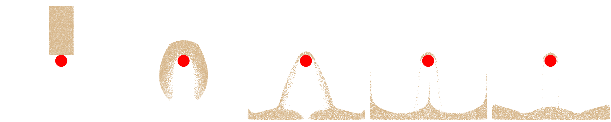

## Putting It All Together

In an MPM simulation, simulation data include material point data and grid data, we defined material point data following [Section 26.1](./lec26.1-material_particles.md), with one additional $\mathbf{C}_p$ used for APIC transfer scheme and `log_J_diff` as the volume correction term used in [Section 29.1](./lec29.1-drucker_prager.md). The sample points are sampled using the Poisson-disk sampling. We define the 2D background as a dense grid, which can be further optimized as a sparse grid, we leave this as the  future work for readers:

```python
{{#include solid-sim-tutorial/10_mpm_sand/simulator.py:data_def}}
```

At the beginning of each simulation step, the grid must be cleared before accumulating new particle-to-grid transfers.

```python
{{#include solid-sim-tutorial/10_mpm_sand/simulator.py:reset_grid}}
```

During the particle-to-grid (P2G) transfer, we use quadratic B-spline interpolation to distribute particle mass, momentum, and internal force contributions to neighboring grid nodes.

```python
{{#include solid-sim-tutorial/10_mpm_sand/simulator.py:p2g}}
```

During the grid-to-particle (G2P) transfer, we gather the updated velocity and affine velocity matrix from the background grid, and compute the trial elastic deformation gradient prior to enforcing plasticity via return mapping.

```python
{{#include solid-sim-tutorial/10_mpm_sand/simulator.py:g2p}}
```

Finally, we enforce the Drucker-Prager elastoplastic yield condition with volume correction via return mapping, and advance particle positions through advection.

```python
{{#include solid-sim-tutorial/10_mpm_sand/simulator.py:particle_update}}
```

A full MPM simulation step consists of the following stages:

```python
{{#include solid-sim-tutorial/10_mpm_sand/simulator.py:time_step}}
```

<figure>
    <center>
    
    </center>
    <figcaption><b>{{fig}}{fig:lec27:mpm_sand_simulation_result}</b> Time sequence of a 2D sand block falling onto a static red sphere collider. The sand undergoes irreversible deformation and splashing upon impact, demonstrating granular flow and frictional boundary response. </figcaption>
</figure>