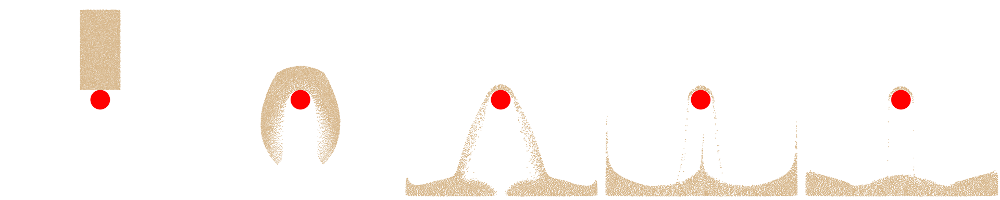

## Affine Particle-In-Cell Transfer

We defined the material point data following [Simulation Setup](./lec29.1-simulation_setup.md), extending it with two additional terms: the affine velocity field $\mathbf{C}_p$ used in the APIC transfer scheme and the scalar `log_J_diff` used for volume correction as described in [Drucker-Prager Elastoplasticity](./lec30.1-drucker_prager.md).

During the particle-to-grid (P2G) transfer, we adopt the **APIC formulation** for momentum exchange. Instead of directly transferring particle velocity, we include the local affine velocity field $\mathbf{C}_p$. Specifically, momentum is transferred using the form:

{{imp}}{imp:lec30:apic_p2g}[Affine Transfer in APIC Particle-to-Grid (P2G), simulator.py]
```python
{{#include solid-sim-tutorial/11_mpm_sand/simulator.py:apic_p2g}}
```

Here, `dpos` is the offset from the particle to the grid node.

During the grid-to-particle (G2P) transfer, we gather both the updated velocity and the **affine velocity matrix $\mathbf{C}_p$** from the background grid. The affine matrix is computed from the weighted outer product of grid velocities and position offsets. This allows each particle to retain local velocity variation, significantly improving simulation stability and reducing numerical dissipation compared to PIC.

{{imp}}{imp:lec30:apic_g2p}[Affine Transfer in APIC Grid-to-Particle (G2P), simulator.py]
```python
{{#include solid-sim-tutorial/11_mpm_sand/simulator.py:apic_g2p}}
```

Here, $D$ is a constant factor when using the Quadratic B-spline interpolation function:

{{imp}}{imp:lec30:D_def}[Constant D for Quadratic B-spline used for APIC, simulator.py]
```python
{{#include solid-sim-tutorial/11_mpm_sand/simulator.py:D_def}}
```

<figure>
    <center>
    
    </center>
    <figcaption><b>{{fig}}{fig:lec30:mpm_sand_simulation_result}</b> Time sequence of a 2D sand block falling onto a static red sphere collider. The sand undergoes irreversible deformation and splashing upon impact, demonstrating granular flow and frictional boundary response. </figcaption>
</figure>