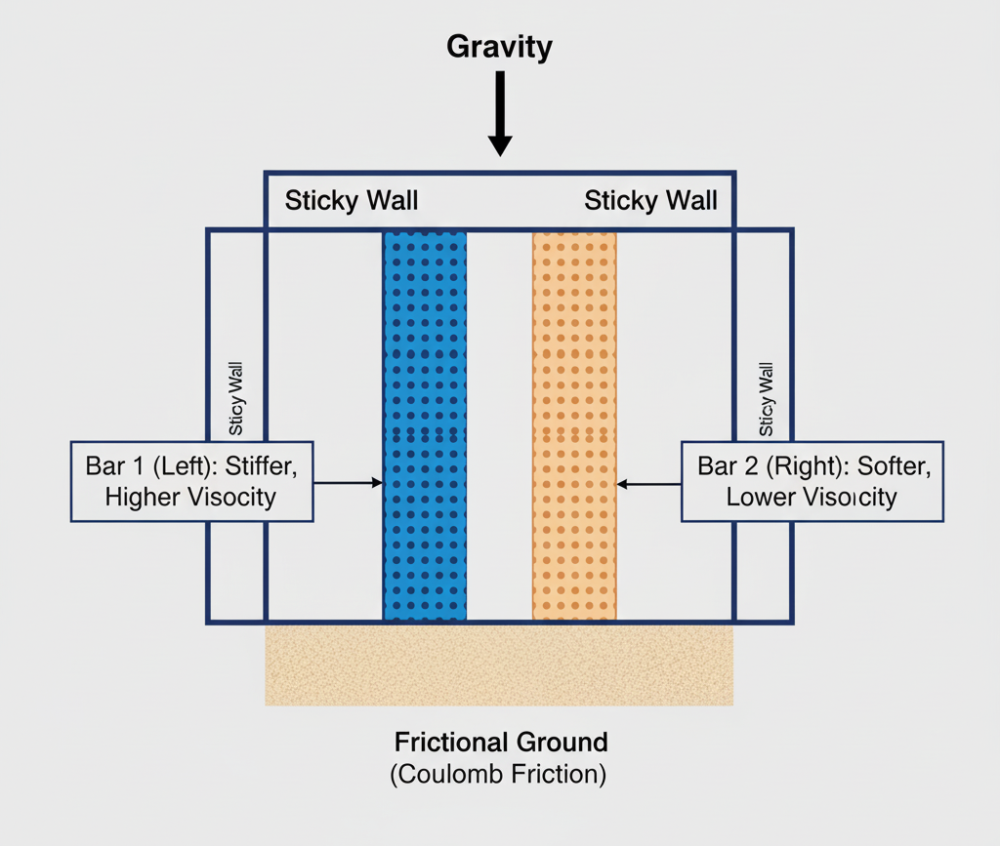
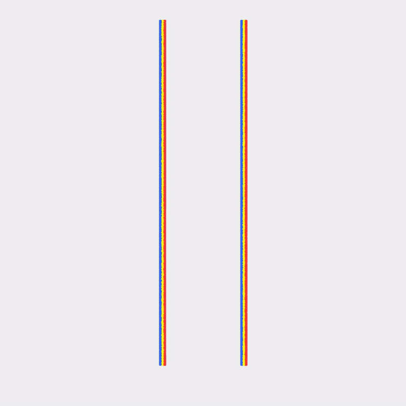

# 2D Viscoplastic Bars

**Author of this lecture: [Žiga Kovačič](https://zzigak.github.io), Cornell University*

This chapter presents the implementation of a **viscoplastic** material model using the St. Venant-Kirchhoff (StVK) elasticity model. The viscoplastic model extends traditional plasticity by incorporating **rate-dependent behavior**, where the material's resistance to permanent deformation depends on how quickly it is being deformed. This makes it suitable for simulating materials like toothpaste, clay, or highly viscous fluids.

Unlike standard rate-independent plasticity, viscoplastic materials exhibit a **yield stress that increases with plastic strain rate**. This means materials deform more readily under slower loading, while offering greater resistance under rapid deformation—characteristic of viscous fluid-like behavior.

## St. Venant-Kirchhoff Elasticity Model

The viscoplastic model is built on top of the **St. Venant-Kirchhoff (StVK)** elasticity model, formulated in **logarithmic (Hencky) strain space**. The StVK model computes stress from the log strain using the SVD of the deformation gradient.

Given a deformation gradient $\mathbf{F}$ with SVD $\mathbf{F} = \mathbf{U}\boldsymbol{\Sigma}\mathbf{V}^T$, the **log strain** is defined as:
$$\boldsymbol{\epsilon} = \log(\boldsymbol{\Sigma})$$

The **deviatoric log strain** is:
$$\hat{\boldsymbol{\epsilon}} = \boldsymbol{\epsilon} - \frac{1}{d}\text{tr}(\boldsymbol{\epsilon})\mathbf{I}$$

where $d$ is the spatial dimension and $\text{tr}(\boldsymbol{\epsilon}) = \epsilon_0 + \epsilon_1$ is the trace of the log strain.

The **deviatoric stress** (Cauchy stress deviator) in StVK formulation is:
$$\hat{\boldsymbol{s}} = 2\mu \hat{\boldsymbol{\epsilon}}$$

where $\mu$ is the shear modulus. The stress is computed in the principal frame and then rotated back to the material frame using the SVD basis.

## Rate-Dependent Plasticity Model

The viscoplastic model is formulated in **log-strain space** using the SVD of the deformation gradient, similar to the Drucker-Prager model. The key difference is that the yield condition now includes a rate-dependent term.

The **yield function** checks if the deviatoric stress magnitude exceeds the rate-dependent yield stress:
$$y = \|\hat{\boldsymbol{s}}\| - \sqrt{\frac{2}{3}} \sigma_y(\dot{\epsilon}_p)$$

where the yield stress depends on the plastic strain rate:
$$\sigma_y(\dot{\epsilon}_p) = \sigma_0 + \eta_p |\dot{\epsilon}_p|$$

Here, $\sigma_0$ is the static yield stress and $\eta_p$ is the plastic viscosity coefficient.

## Viscoplastic Return Mapping

When $y > 0$, the material yields and we apply viscoplastic return mapping. The viscous resistance is incorporated through a **denominator term** that depends on the plastic viscosity and time step:

$$\text{denom} = 1 + \frac{\eta_p}{2\mu_\text{hat} \Delta t}$$

where $\mu_\text{hat} = \mu \frac{b_\text{trial}}{2}$ is a modified shear modulus based on the trial configuration.

The corrected stress magnitude is computed as:
$$\|\hat{\boldsymbol{s}}^{n+1}\| = \|\hat{\boldsymbol{s}}_\text{trial}\| - \frac{y}{\text{denom}}$$

This effectively reduces the stress correction by a factor proportional to the viscous resistance, making the material more resistant to rapid deformation.

## Implementation

The viscoplastic return mapping is implemented using SVD and log strain:

```python
@ti.func
def viscoplastic_return_mapping_stvk_2d(F_trial, mu_p, lam_p, yield_stress_p, plastic_viscosity_p, dt_val):
    U, sig, V = ti.svd(F_trial)
    sig0 = ti.max(sig[0, 0], 0.01)
    sig1 = ti.max(sig[1, 1], 0.01)
    
    epsilon = ti.Vector([ti.log(sig0), ti.log(sig1)])
    trace_epsilon = epsilon[0] + epsilon[1]
    epsilon_hat = epsilon - ti.Vector([trace_epsilon / 2.0, trace_epsilon / 2.0])
    
    s_trial = 2.0 * mu_p * epsilon_hat
    s_trial_norm = s_trial.norm()
    y = s_trial_norm - ti.sqrt(2.0 / 3.0) * yield_stress_p
    
    F_result = F_trial
    if y > 0:
        b_trial = sig0 * sig0 + sig1 * sig1
        mu_hat = mu_p * b_trial / 2.0
        denom = 1.0 + plastic_viscosity_p / (2.0 * mu_hat * dt_val)
        s_new_norm = s_trial_norm - y / denom
        s_scale = s_new_norm / s_trial_norm if s_trial_norm > 1e-10 else 1.0
        s_new = s_scale * s_trial
        epsilon_new = 1.0 / (2.0 * mu_p) * s_new + ti.Vector([trace_epsilon / 2.0, trace_epsilon / 2.0])
        sig_elastic = ti.Matrix([[ti.exp(epsilon_new[0]), 0.0], [0.0, ti.exp(epsilon_new[1])]])
        F_result = U @ sig_elastic @ V.transpose()
    
    return F_result
```

The return mapping computes the log strain from the SVD, extracts the deviatoric component, checks the yield condition, and if yielding occurs, applies a viscous correction that reduces the stress update. The corrected strain is then exponentiated and used to reconstruct the elastic deformation gradient.

## Two-Bar Simulation Setup

The simulation initializes two vertical bars side-by-side with different material properties to demonstrate how viscoplastic behavior depends on yield stress and plastic viscosity:

```python
# Material parameters for viscoplastic bars
E_toothpaste = 350.0
mu_toothpaste = E_toothpaste / (2 * (1 + nu))
lam_toothpaste = E_toothpaste * nu / ((1 + nu) * (1 - 2 * nu))

# Bar 1 (Left): Higher yield stress and viscosity - stiffer, more resistant
bar1_yield_stress = 1000.0
bar1_plastic_viscosity = 500.0

# Bar 2 (Right): Lower yield stress and viscosity - softer, more fluid-like
bar2_yield_stress = 100.0
bar2_plastic_viscosity = 50.0
```

The viscoplastic material is identified by `material[p] == 3`, and the return mapping is applied during the particle update:

```python
if material[p] == 3:
    F[p] = viscoplastic_return_mapping_stvk_2d(
        F_trial, mu_toothpaste, lam_toothpaste, yield_stress[p], plastic_viscosity[p], dt
    )
```

As the simulation progresses under gravity, the rate-dependent behavior becomes apparent: faster deformation is resisted more strongly due to the viscous term, while slower deformation flows more readily.

The stress computation for viscoplastic materials uses the StVK formulation:

```python
@ti.func
def stvk_stress_2d(F_elastic, U, V, sig, mu_p, lam_p):
    sig0 = ti.max(sig[0, 0], 0.01)
    sig1 = ti.max(sig[1, 1], 0.01)
    epsilon = ti.Vector([ti.log(sig0), ti.log(sig1)])
    log_sig_sum = ti.log(sig0) + ti.log(sig1)
    ONE = ti.Vector([1.0, 1.0])
    tau = 2.0 * mu_p * epsilon + lam_p * log_sig_sum * ONE
    tau_mat = ti.Matrix([[tau[0], 0.0], [0.0, tau[1]]])
    return U @ tau_mat @ V.transpose() @ F_elastic.transpose()
```

This function computes the first Piola-Kirchhoff stress from the elastic deformation gradient using the StVK model in Hencky strain space, accounting for both deviatoric and volumetric terms.

<figure>
    <center>
        
        <figcaption><b>{{fig}}{fig:viscoplastic:bars}</b> Two viscoplastic bars with different material properties: Bar 1 (left) has higher yield stress and viscosity, while Bar 2 (right) is softer and more fluid-like.</figcaption>
    </center>
</figure>

## Simulation Results

The complete viscoplastic implementation demonstrates realistic rate-dependent behavior through the StVK-based viscoplastic model. The simulation clearly shows how different material properties affect deformation behavior.

<figure>
    <center>
        
        <figcaption><b>{{fig}}{fig:viscoplastic:simulation}</b> Time evolution of two viscoplastic bars collapsing under gravity after wall removal at 3.0 seconds. Bar 1 (left, high yield stress and viscosity) maintains its shape better and deforms more slowly, while Bar 2 (right, low yield stress and viscosity) flows more readily and collapses faster, demonstrating the rate-dependent behavior of viscoplastic materials.</figcaption>
    </center>
</figure>

In the simulation, we observe that:
- **Bar 1 (left)** collapses more slowly and maintains more of its vertical shape due to its higher yield stress (1000.0) and plastic viscosity (500.0), behaving like a stiffer, more solid-like viscoplastic material.
- **Bar 2 (right)** collapses faster and spreads horizontally more quickly due to its lower yield stress (100.0) and plastic viscosity (50.0), behaving more like a fluid-like viscoplastic material.

These differences highlight how viscoplastic materials exhibit rate-dependent behavior—materials with higher viscosity resist rapid deformation more strongly, while materials with lower viscosity flow more readily under the same loading conditions.
