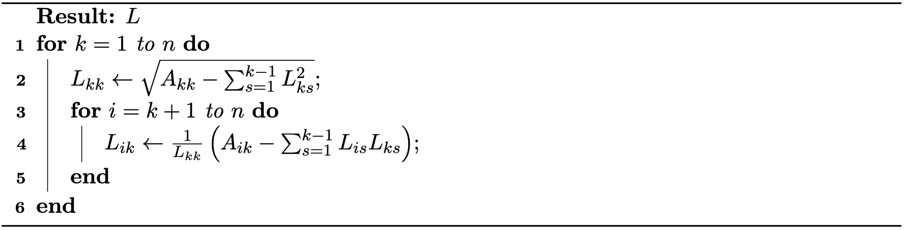

## Direct Solver

Direct solvers are a class of algorithms designed to compute the exact solution to a linear system in a finite number of steps, up to numerical precision. In the context of optimization and simulation, the coefficient matrix $A$ is often symmetric positive definite (SPD), making direct solvers both robust and efficient for moderate-sized problems.

### Forward and Backward Substitution for Triangular Matrices

Solving $A x = b$ is particularly straightforward when $A$ is triangular. If $A$ is lower triangular, i.e.
$$
\begin{bmatrix}
  a_{11} & 0      & \cdots & 0 \\
  a_{21} & a_{22} & \cdots & 0 \\
  \vdots & \vdots & \ddots & 0 \\
  a_{n1} & a_{n2} & \cdots & a_{nn}
\end{bmatrix}
\begin{bmatrix} x_1 \\ x_2 \\ \vdots \\ x_n \end{bmatrix} = \begin{bmatrix} b_1 \\ b_2 \\ \vdots \\ b_n \end{bmatrix}.
{{numeq}}{eq: lec31:tri_system}
$$
the system can be solved by forward substitution. The $i$-th variable is solved as:
$$
x_i = \frac{1}{a_{ii}} \left( b_i - \sum_{j=1}^{i-1} a_{ij} x_j \right), \quad i = 1, \ldots, n.
{{numeq}}{eq: lec31:forward_substitution}
$$
This process proceeds from $i=1$ to $n$, using previously computed $x_j$ for $j<i$.

If $A$ is upper triangular, the system is solved by backward substitution:
$$
x_i = \frac{1}{a_{ii}} \left( b_i - \sum_{j=i+1}^{n} a_{ij} x_j \right), \quad i = n, n-1, \ldots, 1.
{{numeq}}{eq: lec31:backward_substitution}
$$
This process proceeds from $i=n$ down to $1$, using already computed $x_j$ for $j>i$.

### Cholesky Decomposition

For general SPD matrices, we can reduce the problem to triangular systems using the Cholesky decomposition. Given $A$ SPD, we can factor $A = LL^T$, where $L$ is lower triangular.

> **{{met}}[Cholesky Decomposition]** Given a symmetric positive definite matrix $A$, the Cholesky decomposition computes a lower triangular matrix $L$ such that $A = LL^T$. The algorithm is as follows: <figure>
    

    <b><figcaption>{{alg}}{alg:lec31:choleskly}[The Cholesky Decomposition Algorithm]</figcaption></b>
    
    

</figure>

Once the decomposition is computed, solving $A x = b$ reduces to two triangular systems:

1. **Forward substitution:** Solve $L y = b$ for $y$.
2. **Backward substitution:** Solve $L^T x = y$ for $x$.

Cholesky decomposition takes advantage of the symmetry and positive definiteness of $A$, reducing both computational cost and memory usage compared to general-purpose methods like LU decomposition. Direct solvers are widely used when the system size is not too large, or when high accuracy is required for ill-conditioned systems. For very large or highly sparse systems, iterative solvers may be preferred, as discussed in the next section.