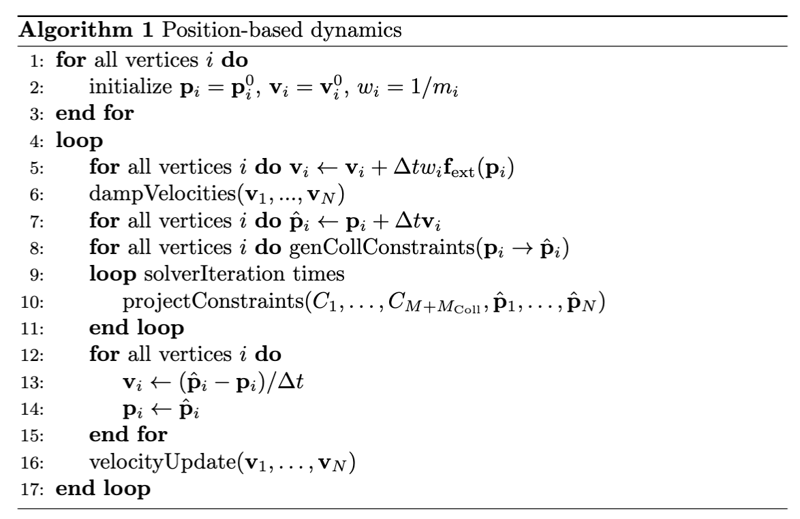

# Core Framework

The PBD framework simulates a physical object by discretizing it into a set of $N$ particles and defining its behavior through $M$  geometric constraints (relationships).  The central idea is to treat the system as a set of particles and constraints. At each time step, particle positions are first predicted using an explicit integration scheme, after which an iterative solver adjusts these predicted positions to satisfy all geometric constraints. We can formally define such a system as follows:

> **{{def}}{def:pbd:system}[PBD System]**
> A PBD system is a tuple consisting of a set of $N$ particles and a set of $M$ constraints.
>
>Each **particle** $i\in \{1,\dots,N\}$ is characterized by its position $\bm{p}_i \in \mathbb{R}^3$, velocity $\bm{v}_i \in \mathbb{R}^3$, and mass $m_i$. For convenience, we define the inverse mass $w_i = 1/m_i$, where $w_i=0$ for infinitely massive (i.e., static or kinematically controlled) particles.
>
> The dynamic behavior is governed by a **set of constraints**. Each constraint $j\in \{1,\dots M\}$ is defined by a scalar-valued function $C_j(\bm{p}_1, \dots, \bm{p}_{n_j})$ which operates on a subset of $n_j$ particles. The constraint is satisfied if $C_j=0$ for an *equality* constraint, or $C_j \ge 0$ for an *inequality* constraint.

The simulation proceeds in discrete time steps of size $\Delta t$. The central loop of the PBD algorithm can be described as follows. 

<figure><figcaption><b>{{fig}}{fig:lec11:pbd_algo}[PBD Main Algorithm]</b>The core of the loop is a multi-phase process: velocity and position prediction, constraint construction, constraint solving, and state update. </figcaption></figure>

Note that since the algorithm simulates a system which is 2nd order in $t$, we need to specify both positions and velocities before the simulation loop starts. This loop structure ensures that velocities are implicitly updated based on the geometric corrections performed by the solver, producing the correct behavior for a second-order dynamical system. 

