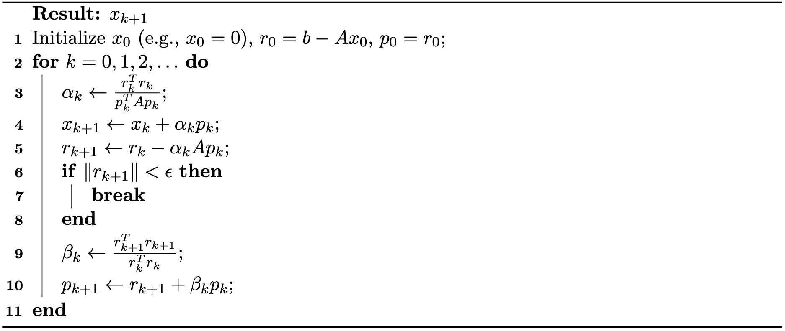

## Conjugate Gradient Method

The Conjugate Gradient (CG) method is a powerful iterative algorithm for solving large, sparse linear systems of the form $Ax = b$, where $A$ is symmetric positive definite (SPD). Unlike general iterative methods such as Jacobi and Gauss-Seidel, CG is specifically designed for SPD matrices and has become fundamental in scientific computing and numerical simulation.

### Formulation as Quadratic Optimization

The conjugate gradient method can be elegantly understood as an optimization algorithm for minimizing the quadratic function:
$$
    f(x) = \frac{1}{2} x^T A x - b^T x,
    {{numeq}}{eq: lec31:cg_optimization}
$$
where $A$ is SPD. The unique global minimizer of $f(x)$ is precisely the solution to $Ax = b$.

The classical steepest descent method updates $x$ along the negative gradient direction $-\nabla f(x) = b - Ax$, but this approach can suffer from slow convergence, particularly when $A$ is ill-conditioned. The CG method overcomes this limitation by searching along a carefully chosen sequence of directions $p_k$ that are $A$-conjugate (or $A$-orthogonal), meaning $p_i^T A p_j = 0$ for $i \neq j$. This conjugacy property ensures that progress made along one direction is never undone by subsequent steps, and the minimization along each direction becomes independent of the others.

### Line Search

Given a sequence of conjugate directions $p_0, p_1, p_2, \ldots$, the problem of minimizing the quadratic function reduces to finding optimal step sizes $\alpha_i$ such that $\sum_{i=0}^{n-1} \alpha_i p_i$ closely approximates the solution $x^*$.

The most straightforward approach is **greedy line search**: starting from an initial point $x_0$, we select a search direction $p_0$ and then minimize $f(x_0 + \alpha_0 p_0)$ with respect to $\alpha_0$. For quadratic functions, this optimization has a simple closed-form solution that avoids matrix inversion:
$$
    \alpha_0 = \frac{p_0^T (b - A x_0)}{p_0^T A p_0}.
$$
The intuition is clear: we start at $x_0$, choose a direction $p_0$, and move along this direction until the objective function is minimized. While this may not reach the global minimum in one step, it guarantees progress toward the optimal solution.

This procedure is then repeated iteratively: at the new point $x_1 = x_0 + \alpha_0 p_0$, we select the next direction $p_1$, compute the corresponding step size $\alpha_1$, and continue.

The general iteration process can be summarized as:
$$
\begin{aligned}
\alpha_i &= \frac{p_i^T r_i}{p_i^T A p_i},\\
x_{i+1} &= x_i + \alpha_i p_i,\\
r_{i+1} &= r_i - \alpha_i A p_i
\end{aligned}
{{numeq}}{eq: lec31:step_size}
$$
where $p_0, p_1, p_2, \ldots$ are the search directions and $r_i = b - Ax_i$ is the residual at step $i$. Note that the residual can be updated without recomputing $Ax_{i+1}$ from scratch: $r_{i+1} = b - A x_{i+1} = b - A (x_i + \alpha_i p_i) = r_i - \alpha_i A p_i$.

### Conjugate Directions

The choice of search directions is crucial for the method's performance. If the directions $p_0, p_1, p_2, \ldots$ are poorly chosen, convergence will be slow. In particular, gradient descent (which uses the steepest descent directions) exhibits slow convergence for ill-conditioned matrices $A$. 

In contrast, if we choose the directions to be mutually $A$-conjugate, the algorithm achieves remarkable efficiency: there is no "zigzagging" behavior, and we obtain the exact solution in at most $n$ steps, where $n$ is the dimension of the system:
$$
    p_i^T A p_j = 0, \quad \forall i \neq j.
{{numeq}}{eq:lec31:A-conjugate}
$$

Without loss of generality, assume $x_0 = 0$ and set $p_0$ to be the initial residual. Since $x_0 = 0$, the gradient at $x_0$ is $Ax_0 - b = -b$, so we set $p_0 = b$. The remaining directions will be constructed to be $A$-conjugate to all previous directions.

Let $r_k$ denote the residual at the $k$-th step:
$$
    r_k = b - A x_k.
{{numeq}}{eq:lec31:residual}
$$
Note that $r_k$ equals the negative gradient of $f$ at $x_k$, so standard gradient descent would move in the direction $r_k$. 

To construct conjugate directions, we require that each new search direction $p_k$ be built from the current residual $r_k$ while being $A$-orthogonal to all previous search directions. We start with the negative gradient $r_k$ and orthogonalize it against all previous search directions $p_0, p_1, \ldots, p_{k-1}$ using the Gram–Schmidt process:
$$
    p_k = r_k - \sum_{i=0}^{k-1} \frac{p_i^T A r_k}{p_i^T A p_i} p_i.
{{numeq}}{eq:lec31:conjugate_direction}
$$

### Algorithmic Simplification

The expressions above can be significantly simplified, leading to the elegant final form of the conjugate gradient algorithm. The key insight lies in proving two fundamental orthogonality relationships.

**Orthogonality Properties.** We first establish that the following orthogonality relations hold:
$$
    p_i^T r_j = 0, \quad \forall i < j,
{{numeq}}{eq:lec31:lemma}
$$
$$
    r_i^T r_j = 0, \quad \forall i \neq j.
    {{numeq}}{eq:lec31:lemma2}
$$

**Proof Sketch.** From the residual update formula (Equation {{eqref:eq:lec31:residual}}), we can write recursively:
$$ 
    r_{j} = r_{j-1} - \alpha_{j-1} A p_{j-1} = r_i - \sum_{k=i}^{j-1} \alpha_{k} A p_{k}.
$$
Taking the dot product with $p_i$ on both sides:
$$
    p_i^T r_j = p_i^T r_i - \sum_{k=i}^{j-1} \alpha_{k} p_{i}^T A p_{k}.
$$
By the $A$-conjugacy property (Equation {{eqref:eq:lec31:A-conjugate}}) and the step size formula $\alpha_i = \frac{p_i^T r_i}{p_i^T A p_i}$, we can verify that $p_i^T r_j = 0$ for $i < j$. 

The second orthogonality relation $r_i^T r_j = 0$ follows from the fact that each residual $r_j$ lies in the span of the search directions $\{p_0, p_1, \ldots, p_{j-1}\}$ by construction, and these directions are built from previous residuals.

**Simplified Formulas.** Using these orthogonality properties, the conjugate direction formula (Equation {{eqref:eq:lec31:conjugate_direction}}) simplifies dramatically. Since $p_i^T r_k = 0$ for $i < k$, we have:
$$
    p_k^T r_k = r_k^T r_k.
$$

This allows us to simplify the step size calculation:
$$
    \alpha_k = \frac{r_k^T r_k}{p_k^T A p_k}.
    {{numeq}}{eq:lec31:simple_step_size}
$$

For the conjugate direction update, we can show that only the most recent direction matters. Using the residual update formula and the orthogonality properties:
$$
\begin{aligned}
    p_{k+1} &= r_{k+1} - \sum_{i=0}^{k} \frac{p_i^T A r_{k+1}}{p_i^T A p_i} p_i \\
            &= r_{k+1} - \sum_{i=0}^{k}\frac{r_{k+1}^T A p_i}{p_i^T A p_i} p_i \\
            &= r_{k+1} - \sum_{i=0}^{k} \frac{r_{k+1}^T (r_i - r_{i+1})}{\alpha_i p_i^T A p_i} p_i
\end{aligned}
$$

Applying the orthogonality relations (Equations {{eqref:eq:lec31:lemma2}} and {{eqref:eq:lec31:simple_step_size}}), this simplifies to:
$$
\begin{aligned}
    p_{k+1} &= r_{k+1} + \sum_{i=0}^{k} \frac{r_{k+1}^T  r_{i+1}}{\alpha_i p_i^T A p_i} p_i \\
            &= r_{k+1} + \sum_{i=0}^{k} \frac{r_{k+1}^T  r_{i+1}}{r_i^T r_i} p_i \\
            &= r_{k+1} + \frac{r_{k+1}^T  r_{k+1}}{r_k^T r_k} p_k
\end{aligned}
$$

This remarkable simplification shows that we only need to retain the most recent search direction $p_k$ to compute the next one $p_{k+1}$.

**Final Algorithm.** The simplified CG algorithm is summarized in {{ref: alg:lec31:cg}}:
<figure>
    

    <b><figcaption>{{alg}}{alg:lec31:cg}[The Conjugate Gradient Method]</figcaption></b>
    
    

</figure>

### Preconditioning

The convergence rate of the conjugate gradient method is fundamentally determined by the condition number of matrix $A$. When $A$ is ill-conditioned (i.e., has a large condition number), CG may converge slowly, requiring many iterations to reach acceptable accuracy.

**Preconditioning** is a crucial technique for accelerating convergence by transforming the original system into an equivalent one with more favorable spectral properties. The idea is to solve a modified system:
$$
M^{-1} A x = M^{-1} b,
$$
where $M$ is a carefully chosen **preconditioner** matrix that approximates $A$ but is much easier to invert.

A simple yet effective choice is the **diagonal (Jacobi) preconditioner**, where $M = \text{diag}(A)$ contains only the diagonal entries of $A$. The preconditioned CG algorithm then solves the transformed system while maintaining the essential structure of the original algorithm.

In practice, preconditioning amounts to scaling the residuals at each iteration by $M^{-1}$, which is computationally inexpensive when $M$ is diagonal. The preconditioned CG algorithm follows the same iterative structure as standard CG, but operates on the preconditioned residuals, often achieving significantly faster convergence for ill-conditioned problems.
