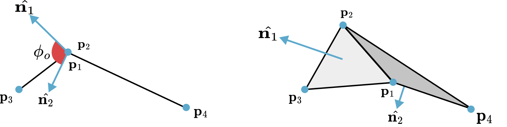

## Cloth: Stretching and Bending

In the context of Position-Based Dynamics (PBD), the complex mechanical behaviors of cloth, such as its resistance to stretching and bending, are modeled through a system of geometric constraints. Instead of accumulating forces, the PBD framework directly manipulates the positions of the mesh vertices to satisfy these constraints in an iterative manner. This section will detail the formulation of fundamental constraints for cloth simulation. 

### Stretching Resistance via Distance Constraints

The primary characteristic of most textiles is their high resistance to stretching. In PBD, this property is enforced by constraining the distance between connected particles to remain close to its initial, or rest, distance. This is one of the simplest yet most crucial constraints in the PBD ecosystem (we have already seen this constraint in {{ref: exp:solver:distance_constraint}})

> **{{exp}}{exp:cloth:stretching}[Stretching Constraint]**
> Consider two particles, $i=1, 2$, with positions $\bm{p}_1$ and $\bm{p}_2$, masses $m_1$ and $m_2$, and a rest distance $d$ between them. The stretching constraint function $C$ is defined as the difference between the current distance and the rest distance:
 $$
 {{numeq}}{eq:cloth:stretch_constraint}
 C(\bm{p}_1, \bm{p}_2) = \|\bm{p}_1 - \bm{p}_2\| - d
 $$
> The goal is to find corrections $\Delta\bm{p}_1$ and $\Delta\bm{p}_2$ such that $C(\bm{p}_1+\Delta\bm{p}_1, \bm{p}_2+\Delta\bm{p}_2) = 0$. The gradients of the constraint function with respect to the particle positions are:
 $$
 \nabla_{\bm{p}_1} C = \frac{\bm{p}_1 - \bm{p}_2}{\|\bm{p}_1 - \bm{p}_2\|} = \bm{n} \quad \text{and} \quad \nabla_{\bm{p}_2} C = -\frac{\bm{p}_1 - \bm{p}_2}{\|\bm{p}_1 - \bm{p}_2\|} = -\bm{n}
 $$
> where $\bm{n}$ is the unit vector along the axis connecting the two particles. Following the general PBD projection formula {{eqref:eq:pbd:final_correction}}, the scalar Lagrange multiplier $\lambda$ is computed as:
 $$
 \lambda = \frac{C(\bm{p}_1, \bm{p}_2)}{w_1\|\nabla_{\bm{p}_1} C\|^2 + w_2\|\nabla_{\bm{p}_2} C\|^2} = \frac{\|\bm{p}_1 - \bm{p}_2\| - d}{w_1 + w_2}
 $$
> where $w_i = 1/m_i$ is the inverse mass of particle $i$. The position corrections are then found by moving the particles along their respective gradient directions, scaled by their inverse mass and $\lambda$:
 $$
 \Delta\bm{p}_1 = - \frac{w_1}{w_1+w_2}(\|\bm{p}_1 - \bm{p}_2\| - d)\bm{n} \\
 \Delta\bm{p}_2 = + \frac{w_2}{w_1+w_2}(\|\bm{p}_1 - \bm{p}_2\| - d)\bm{n}
 $$
> These corrections, when applied, will move the particles to exactly satisfy the rest length. Note that the total correction is distributed between the particles based on their inverse mass, ensuring that lighter particles move more than heavier ones and that linear momentum is conserved ($\sum m_i \Delta \bm{p}_i = \bm{0}$).

To achieve different levels of elasticity, a stiffness parameter $k \in [0, 1]$ can be introduced by scaling the corrections $\Delta\bm{p}_i$ by $k$. This allows for materials with varying elasticity, from perfectly rigid ($k=1$) to completely unstiff ($k=0$).

### Dihedral Angle Bending Constraints

While stretching constraints maintain the structural integrity of the cloth mesh, they do not prevent it from folding unnaturally. Bending resistance, which dictates how the cloth wrinkles and drapes, is modeled by constraining the angle between adjacent triangles.

The constraint is defined for a pair of triangles $(\bm{p}_1, \bm{p}_3, \bm{p}_2)$ and $(\bm{p}_1, \bm{p}_2, \bm{p}_4)$ sharing a common edge $(\bm{p}_1, \bm{p}_2)$. The bending resistance is a function of the **dihedral angle** $\phi$ between the two triangles, which is the initial angle between their respective normal vectors $\bm{n}_1$ and $\bm{n}_2$. The constraint aims to restore this angle to its rest value, $\phi_0$.

<figure><figcaption><b>[Bending Constraints]</b> The provided illustration shows the dihedral angle for a pair of triangles in $\mathbb{R}^3$.</figcaption></figure>

The constraint function is formulated as:
$$
{{numeq}}{eq:cloth:bend_constraint}

C_{\text{bend}}(\bm{p}_1, \bm{p}_2, \bm{p}_3, \bm{p}_4) = \arccos(\bm{n}_1 \cdot \bm{n}_2) - \phi_0
$$
where the normals are computed as:
$$
\begin{align*}
\bm{n}_1 &= (\bm{p}_{2,1} \times \bm{p}_{3,1}) / \|\bm{p}_{2,1} \times \bm{p}_{3,1}\|\\
\bm{n}_2 &= (\bm{p}_{2,1} \times \bm{p}_{4,1}) / \|\bm{p}_{2,1} \times \bm{p}_{4,1}\|.
\end{align*}
$$ 
The gradients of this function with respect to the four vertex positions $(\bm{p}_1, \bm{p}_2, \bm{p}_3, \bm{p}_4)$ are then computed, and the standard PBD projection mechanism is used to derive the position corrections. The stiffness of bending is determined using $k_{bend}$ parameter.

A significant advantage of this formulation is its independence from stretching. Because the angle is defined by normalized vectors, the constraint is invariant to the lengths of the triangle edges. 

### Isometric Bending

For surfaces that are nearly inextensible, the isometric bending model {{#cite bergou2006quadratic}} can be used. This model provides a robust formulation based on the local Hessian of the bending energy.

This model considers a stencil for each interior edge $\bm{e}_0$ of the mesh, consisting of the four vertices of the two triangles adjacent to that edge, labeled $\bm{p}_0, \bm{p}_1, \bm{p}_2, \bm{p}_3$. The local bending energy for this stencil is defined as a quadratic form:
$$
{{numeq}}{eq:cloth:iso_energy}

E_{\text{bend}}(\bm{p}_s) = \frac{1}{2} \sum_{i,j \in \{0,1,2,3\}} Q_{ij} (\bm{p}_i ^\top \bm{p}_j)
$$
where $\bm{p}_s = (\bm{p}_0, \bm{p}_1, \bm{p}_2, \bm{p}_3)^T$ is the vector of stencil positions and $\bm{Q} \in \mathbb{R}^{4\times4}$ is a constant matrix representing the local Hessian of the bending energy. This matrix depends only on the rest geometry of the stencil and can be precomputed. Its entries are derived from the cotangents of the angles within the two triangles.

The bending constraint is defined directly from this energy: $C_{\text{bend}}(\bm{p}_s) = E_{\text{bend}}(\bm{p}_s)$. Since the energy is quadratic in the positions, its gradient is linear and straightforward to compute:
$$
{{numeq}}{eq:cloth:iso_gradient}

\frac{\partial C_{\text{bend}}}{\partial \bm{p}_i} = \sum_{j \in \{0,1,2,3\}} \bm{Q}_{ij} \bm{p}_j
$$
This model is particularly effective for garment simulation where fabric is expected to deform isometrically (i.e., without stretching).

