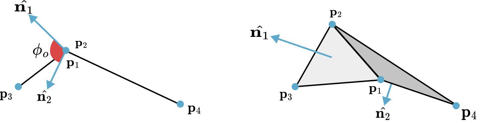

## Dihedral Angle Bending Constraints

While stretching constraints maintain the structural integrity of the cloth mesh, they do not prevent it from folding unnaturally. Bending resistance, which dictates how the cloth wrinkles and drapes, is modeled by constraining the angle between adjacent triangles.

### Theory: Dihedral Angle Constraint Formulation

The constraint is defined for a pair of triangles $(\bm{p}_1, \bm{p}_3, \bm{p}_2)$ and $(\bm{p}_1, \bm{p}_2, \bm{p}_4)$ sharing a common edge $(\bm{p}_1, \bm{p}_2)$. The bending resistance is a function of the **dihedral angle** $\phi$ between the two triangles, which is the initial angle between their respective normal vectors $\bm{n}_1$ and $\bm{n}_2$. The constraint aims to restore this angle to its rest value, $\phi_0$.

<figure><figcaption><b>{{fig}}{fig:viscoplastic:simulation}[Bending Constraints]</b> The provided illustration shows the dihedral angle for a pair of triangles in $\mathbb{R}^3$.</figcaption></figure>

> **{{def}}{def:cloth:bending_constraint}[Dihedral Angle Bending Constraint]**
 The bending constraint function $C_{\text{bend}}$ for four vertices forming two adjacent triangles is:
 $$
 {{numeq}}{eq:cloth:bend_constraint}
 C_{\text{bend}}(\bm{p}_1, \bm{p}_2, \bm{p}_3, \bm{p}_4) = \arccos(\bm{n}_1 \cdot \bm{n}_2) - \phi_0
 $$
 where the normals are computed as:
 $$
 \begin{align*}
 \bm{n}_1 &= (\bm{p}_{2,1} \times \bm{p}_{3,1}) / \|\bm{p}_{2,1} \times \bm{p}_{3,1}\|\\
 \bm{n}_2 &= (\bm{p}_{2,1} \times \bm{p}_{4,1}) / \|\bm{p}_{2,1} \times \bm{p}_{4,1}\|.
 \end{align*}
 $$

The gradients of this function with respect to the four vertex positions $(\bm{p}_1, \bm{p}_2, \bm{p}_3, \bm{p}_4)$ are then computed, and the standard PBD projection mechanism is used to derive the position corrections. The stiffness of bending is determined using $k_{bend}$ parameter.

A significant advantage of this formulation is its independence from stretching. Because the angle is defined by normalized vectors, the constraint is invariant to the lengths of the triangle edges.

### Alternative: Isometric Bending Model

For surfaces that are nearly inextensible, the isometric bending model {{#cite bergou2006quadratic}} can be used. This model provides a robust formulation based on the local Hessian of the bending energy.

This model considers a stencil for each interior edge $\bm{e}_0$ of the mesh, consisting of the four vertices of the two triangles adjacent to that edge, labeled $\bm{p}_0, \bm{p}_1, \bm{p}_2, \bm{p}_3$. The local bending energy for this stencil is defined as a quadratic form:

$$
{{numeq}}{eq:cloth:iso_energy}
E_{\text{bend}}(\bm{p}_s) = \frac{1}{2} \sum_{i,j \in \{0,1,2,3\}} Q_{ij} (\bm{p}_i ^\top \bm{p}_j)
$$
where $\bm{p}_s = (\bm{p}_0, \bm{p}_1, \bm{p}_2, \bm{p}_3)^T$ is the vector of stencil positions and $\bm{Q} \in \mathbb{R}^{4\times4}$ is a constant matrix representing the local Hessian of the bending energy.

The bending constraint is defined directly from this energy: $C_{\text{bend}}(\bm{p}_s) = E_{\text{bend}}(\bm{p}_s)$. Since the energy is quadratic in the positions, its gradient is linear and straightforward to compute:

$$
{{numeq}}{eq:cloth:iso_gradient}
\frac{\partial C_{\text{bend}}}{\partial \bm{p}_i} = \sum_{j \in \{0,1,2,3\}} \bm{Q}_{ij} \bm{p}_j
$$

This model is particularly effective for garment simulation where fabric is expected to deform isometrically (i.e., without stretching).

### Implementation: Bending Constraint Solver

```python
@ti.kernel
def solve_bending_constraints(compliance: ti.f64, dt: ti.f64):
    """Solve bending constraints using distance-based approach"""
    alpha = compliance / (dt * dt)
    for i in range(num_bending_constraints):
        id0, id1 = bending_ids[i, 0], bending_ids[i, 1]
        w0, w1 = inv_mass[id0], inv_mass[id1]
        w_sum = w0 + w1
        if w_sum == 0.0: continue
        
        p0, p1 = pos[id0], pos[id1]
        delta = p0 - p1
        dist = delta.norm()
        if dist == 0.0: continue
        
        grad = delta / dist
        C = dist - bending_lengths[i]
        s = -C / (w_sum + alpha)
        
        pos[id0] += s * w0 * grad
        pos[id1] -= s * w1 * grad
```

This implementation uses a simplified distance-based approach where bending constraints are treated as distance constraints between non-adjacent vertices. While this doesn't capture the full dihedral angle behavior, it provides a computationally efficient approximation that works well for many cloth simulation scenarios.

We need rest lengths to solve the constraints, so we compute all rest bending lengths once before the simulation:

```python
@ti.kernel
def init_physics():
    """Initialize physics state including rest lengths for all constraints"""
    # Initialize stretching constraint rest lengths
    for i in range(num_stretching_constraints):
        id0, id1 = stretching_ids[i, 0], stretching_ids[i, 1]
        stretching_lengths[i] = (pos[id0] - pos[id1]).norm()
    
    # Initialize bending constraint rest lengths
    for i in range(num_bending_constraints):
        id0, id1 = bending_ids[i, 0], bending_ids[i, 1]
        bending_lengths[i] = (pos[id0] - pos[id1]).norm()
```

To identify which vertices become bending constraints, we find pairs of triangles that share an edge, then create constraints between the vertices that are not part of the shared edge:

```python
def find_constraint_indices(tri_ids_np):
    """Extract both stretching and bending constraints from triangle mesh"""
    edge_to_tri_map = {}
    for i, tri in enumerate(tri_ids_np):
        for j in range(3):
            v0_idx, v1_idx = tri[j], tri[(j + 1) % 3]
            edge = tuple(sorted((v0_idx, v1_idx)))
            if edge not in edge_to_tri_map:
                edge_to_tri_map[edge] = []
            edge_to_tri_map[edge].append(i)
    
    stretching_ids = list(edge_to_tri_map.keys())
    bending_ids = []
    
    # Find bending constraints (non-adjacent vertices in adjacent triangles)
    for edge, tris in edge_to_tri_map.items():
        if len(tris) == 2:
            tri0_idx, tri1_idx = tris[0], tris[1]
            p2 = [v for v in tri_ids_np[tri0_idx] if v not in edge][0]
            p3 = [v for v in tri_ids_np[tri1_idx] if v not in edge][0]
            bending_ids.append([p2, p3])
    
    return np.array(stretching_ids, dtype=np.int32), np.array(bending_ids, dtype=np.int32)
```

This creates a network of constraints that resist bending deformation by connecting non-adjacent vertices in adjacent triangles.

```python
stretching_compliance = 0.0  # Very stiff stretching (nearly inextensible)
bending_compliance = 1.0      # Moderate bending resistance
```

Lower stretching compliance makes the cloth more resistant to stretching, while higher bending compliance allows more bending flexibility, creating softer, more drapeable cloth.
