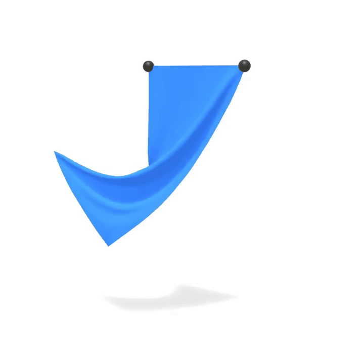

## Complete Cloth Simulation

Now we combine the stretching and bending constraints we've implemented to create a complete cloth simulation. The main simulation loop solves both constraint types iteratively, then updates velocities.

```python
def substep(grab_id, grab_x, grab_y, grab_z):
    """Complete cloth simulation integrating all components"""
    pre_solve(sdt)
    for _ in range(solver_iterations):
        solve_stretching_constraints(stretching_compliance, sdt)
        solve_bending_constraints(bending_compliance, sdt)
    apply_grab(grab_id, grab_x, grab_y, grab_z)
    post_solve(sdt)
```

The solver alternates between stretching and bending constraints in each iteration. Stretching constraints are solved first because they provide structural integrity, then bending constraints add realistic draping behavior.

Before we can run the simulation, we need to set up the physics state. Cloth simulation requires careful mass distribution based on triangle areas to ensure realistic behavior:

```python
@ti.kernel
def init_physics():
    """Initialize physics state with proper mass distribution"""
    for i in range(num_particles):
        prev_pos[i] = pos[i]
        vel[i] = ti.Vector([0.0, 0.0, 0.0])
    
    inv_mass.fill(0.0)
    for i in range(num_tris):
        id0, id1, id2 = tri_ids[i * 3], tri_ids[i * 3 + 1], tri_ids[i * 3 + 2]
        p0, p1, p2 = pos[id0], pos[id1], pos[id2]
        area = 0.5 * (p1 - p0).cross(p2 - p0).norm()
        p_inv_mass = 1.0 / (area / 3.0) if area > 0 else 0.0
        inv_mass[id0] += p_inv_mass
        inv_mass[id1] += p_inv_mass
        inv_mass[id2] += p_inv_mass
    
    # Initialize constraint rest lengths
    for i in range(num_stretching_constraints):
        id0, id1 = stretching_ids[i, 0], stretching_ids[i, 1]
        stretching_lengths[i] = (pos[id0] - pos[id1]).norm()
    for i in range(num_bending_constraints):
        id0, id1 = bending_ids[i, 0], bending_ids[i, 1]
        bending_lengths[i] = (pos[id0] - pos[id1]).norm()
    
    for i in range(num_particles):
        original_inv_mass[i] = inv_mass[i]
```

This initialization computes mass distribution based on triangle areas, ensuring that vertices belonging to larger triangles have more mass. This creates realistic cloth behavior where the material responds appropriately to external forces.

For a hanging cloth scenario, we pin the top vertices by setting their inverse mass to zero:

```python
@ti.kernel
def pin_top_vertices():
    """Pin vertices with highest Y values (top of cloth) by setting their inverse mass to zero"""
    max_y = -1e9
    for i in range(num_particles):
        if pos[i].y > max_y:
            max_y = pos[i].y
    for i in range(num_particles):
        if pos[i].y >= max_y - 1e-6:
            inv_mass[i] = 0.0
```

This creates a "hanging cloth" scenario where the top edge is fixed, allowing the rest of the cloth to drape naturally under gravity.

The simulation also includes interactive manipulation capabilities:

```python
@ti.kernel
def apply_grab(particle_idx: ti.i32, target_x: ti.f64, target_y: ti.f64, target_z: ti.f64):
    """Apply interactive manipulation to a specific particle"""
    if particle_idx != -1:
        target_pos = ti.Vector([target_x, target_y, target_z])
        pos[particle_idx] = target_pos
        vel[particle_idx] = ti.Vector([0.0, 0.0, 0.0])
        grab_indicator_pos[0] = target_pos
```

This allows for real-time interaction with the cloth, enabling users to grab and manipulate specific vertices, which is useful for testing material properties and creating animations.

### Simulation Results

The complete cloth implementation demonstrates realistic fabric behavior through geometric constraints, showcasing proper draping, wrinkling, and response to external forces and manipulation.

<figure>
    <center>
        
    </center>
        <figcaption><b>{{fig}}{fig:cloth:bending}</b> Cloth draping under gravity with stretching and bending constraints enforcing length and curvature.</figcaption>
</figure>