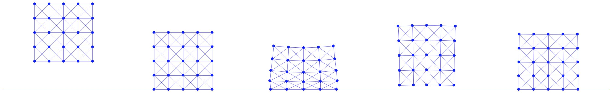

## Case Study: Square Drop

To conclude, let's consider a case study where we simulate a square dropped onto a fixed planar ground. Building on our previous mass-spring model for an elastic square, we augment a barrier potential into its Incremental Potential and apply the filter line search scheme to manage the contact between the square's degrees of freedom (DOFs) and the ground.

The excutable Python project for this section can be found in <p style="color:red;">TODO: get a git org to host the code</p>

If we further limit the planar ground to be horizontal, e.g. at \\(y=y_0\\), its signed distance function can be made even simpler than Equation {{eqref: eq:lec7:half_space_dist}}:
$$
    d(\mathbf{x}) = \mathbf{x}_y - y_0, \quad 
    \nabla d(\mathbf{x}) = 
        \begin{bmatrix}
            0 \\
            1
        \end{bmatrix}, \quad
    \nabla^2 d(\mathbf{x}) = \mathbf{0}.
    {{numeq}}{eq:lec8:dist_ground}
$$
Combining it with Equation {{eqref: eq:lec7:barrier_grad}} and Equation {{eqref: eq:lec7:barrier_hess}}, we can conveniently implement the gradient and Hessian computation for the barrier potential of this horizontal ground:

{{imp}}{imp:lec8:barrier_val_grad_hess}[Barrier energy value, gradient, and Hessian, BarrierEnergy.py]
```python
{{#include solid-sim-tutorial/3_contact/BarrierEnergy.py:val_grad_hess}}
```

For the filter line search, with the position in the last iteration \\(\mathbf{x}\\) and a search direction \\(\mathbf{p}\\) of a specific node, the signed distance function is simply
\\[
    d(\mathbf{x} + \alpha \mathbf{p}) = \mathbf{x}_y + \alpha \mathbf{p}_y - y_0,
\\]
where \\(\alpha\\) is the step size, and there is only one positive real root \\(\alpha = (y_0 - \mathbf{x}_y) / \mathbf{p}_y\\) when \\(\mathbf{p}_y < 0\\) since \\(\mathbf{x}_y > y_0\\) (no interpenetration up to current iteration). Taking the minimum of the positive real root per node then gives us the step size upper bound \\(\alpha_C\\) defined in Equation {{eqref: eq:lec8:alpha_CCD}}:

{{imp}}{imp:lec8:ground_CCD}[Ground CCD, BarrierEnergy.py]
```python
{{#include solid-sim-tutorial/3_contact/BarrierEnergy.py:init_step_size}}
```
Here we scale the upper bound by \\(0.9\times\\) so that exact touching configurations with \\(d=0\\) and \\(b = \infty\\) (floating-point number overflow) can be avoided.

Then once we make sure the step size upper bound is used to initialize the line search

{{imp}}{imp:lec8:filter_ls}[Filter line search, time_integrator.py]
```python
{{#include solid-sim-tutorial/3_contact/time_integrator.py:filter_ls}}
```
and that the contact area weights for all nodes are calculated

{{imp}}{imp:lec8:contact_area}[Contact area, simulator.py]
```python
{{#include solid-sim-tutorial/3_contact/simulator.py:contact_area}}
```
and passed to our simulator, we can simulate the square drop with mass-spring stiffness `k=2e4` and time step size `h=0.01` as shown in {{ref: fig:lec8:square_drop}}.

<figure>
    <center>
    
    </center>
    <figcaption><b>{{fig}}{fig:lec8:square_drop}</b> A mass-spring elastic square is dropped onto the ground with $0$ initial velocity under gravity. Here we show the frames when the square is: just dropped, first touching the ground, compressed to the maximum in this simulation, and becoming static. </figcaption>
</figure>

> **{{rem}}{rm:lec8:contact_layer_integration}[Contact Layer Integration]**
> Since in practice, contact forces are only exerted on the boundary of the solids, the barrier potential should be integrated only on the boundary as well. 
> This also explains why in our case study the contact area weight per node is simply calculated as the diameter of the square evenly distributed onto each boundary node.
> However, as mass-spring elasticity cannot guarantee that all interior nodes will stay inside the boundary of the solid, we simply apply the barrier potential to all nodal DOFs of the square.
